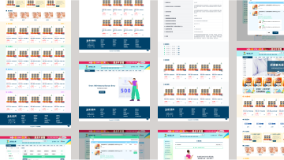

---
# try also 'default' to start simple
theme: apple-basic 
# random image from a curated Unsplash collection by Anthony
# like them? see https://unsplash.com/collections/94734566/slidev
background: /image/Home.png
# some information about your slides, markdown enabled
title: Welcome to Slidev
info: |
  ## Slidev Starter Template
  Presentation slides for developers.

  Learn more at [Sli.dev](https://sli.dev)
# apply any unocss classes to the current slide
class: text-center
# https://sli.dev/custom/highlighters.html
highlighter: shiki
# https://sli.dev/guide/drawing
drawings:
  persist: false
# slide transition: https://sli.dev/guide/animations#slide-transitions
transition: slide-center
# enable MDC Syntax: https://sli.dev/guide/syntax#mdc-syntax
mdc: true

layout: intro-image
image: '/image/Home.png'
---

  <h1>Performance Evaluation</h1>

---
transition: fade-out
---

# Works

App

<table>
  <tr style="border: #fff">
    <td align="center">
      

        
      

      台中派車
    </td>
    <td align="center">
      

        
      

      UCARE
    </td>
  </tr>
</table>

Web

<table>
  <tr style="border: #fff">
    <td align="center">
      

        
      

      老吾老
    </td>
    <td align="center">
      

        
      

      第一郵捷
    </td>
    <td align="center">
      

        
      

      哈佛健康管理
    </td>
  </tr>
  <tr style="border: #fff">
    <td align="center">
      

        
      

      嘉義市城市備援整合
    </td>
    <td align="center">
      

        
      

      春天藥局
    </td>
    <td align="center">
      

        
      

      崇恩戰情中心
    </td>
  </tr>
  <tr style="border: #fff">
    <td align="center">
      

        
      

      海外醫事人員培訓平台
    </td>
  </tr>
</table>

<!--
Here is another comment.
-->

---
transition: slide-up
level: 2
---

# Skills
 

  效率
  洞察需求
  即時反應需求
  對公司產品理解
  溝通協調
  設計實作
  商業分析與研究
  產品技術邏輯
  設計趨勢
  研究方法
  產業趨勢
  分析能力
  專案管理
  風險評估
  時間管理
  自我學習能力
  學習新技術

 

  Vue + Vite
  AI

---
layout: section
---

  <h1>台灣 UX 工作者（不含海外）</h1>
  <h1 class="border-b-8 border-[#F4B461]">年薪平均 88 萬，中位數 77 萬</h1>
  

    104
    1111
    設計師協會
    台灣薪資情報網
  

---
layout: intro-image
image: '/image/Salary.png'
---

# 
Annual Salary

---
level: 2
---

# Future

  

    
專業技能

    

      提升中大型專案管理能力，於開發期視專案開發需求調整設計介面，減少溝通成本。維護良好產品品質，建立企業形象。
    

  

  

    
管理能力

    

      學習更有效管理整體進度並適時的調整項目流程，解決衝突來完成項目。
    

  

  

    
學習與創新

    

      保持追蹤市場設計趨勢與新技術，精進 UI/UX 等領域專業知識，學習新技術如互動設計，將 AI 導入工作中。
    

  

